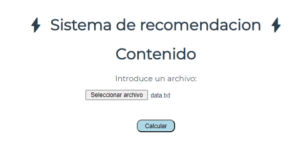
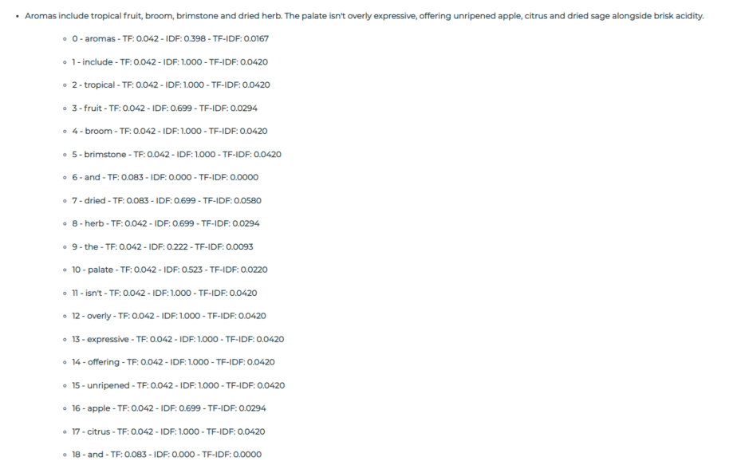
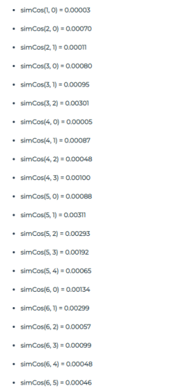

# Recomendation System

## Uso de la aplicacion
```
https://eindhovenlion99.github.io/RecomendationSystem2/
```

## Codigo Fuente

La aplicacion esta basada en Vue, un framework frontend basado en componentes. El primer componente es ```App.vue```, que carga el resto
de los componentes, este fichero es montado por ```main.js```. ```App.vue``` importa los componentes Header (Cabecera) y Footer (Pie de pagina).
Por otro lado carga el componente ```Content.vue```, el cual soporta el codigo de la aplicacion.

Este componente contiene el HTML de la aplicacion, asi como las funciones que hacen los calculos pertinentes y el css del propio componente.

```html
<template>
  <h1>Contenido</h1>
  <div>
    <label for="input-file">Introduce un archivo:</label><br>
    <input type="file" id="input-file">
  </div>
  <button class="button" v-on:click="getData">Calcular</button>
  <div class="solucion" id="solucion"></div>
</template>
```



Una vez le damos al boton calcular, el cual llama a la funcion ```getData()```, la cual recoge los datos del fichero cargado:

```js
  getData() {
    alert("El programa puede tardar hasta 15 segundos")
    this.documents = []
    this.statDocuments = []
    const file = document.getElementById("input-file").files[0];  // Leemos el contenido del fichero
    this.readFileContent(file).then(result => {
      const stringArray = result.split("\n")                      // Dividimos todo el texto en documentos (oraciones)
      stringArray.forEach((element, doc_index) => {               // Cada oracion es un element, junto con su indice
        this.documents.push(element)                              // Añadimos el documento al vector de documentos
        element = element.replace(/,/g,'')                        // Quitamos las comas
        element = element.replaceAll('.', '');                    // Quitamos los puntos
        element = element.toLowerCase()                           // Modificamos todas las palabras a minuscula
        const stringDocuments = element.split(" ")                // Dividmos cada oraciones en palabras (terminos)
        this.lengths.push(stringDocuments.length)
        stringDocuments.forEach((term, term_index) => {                       // Añadimos el indice del documento, el indice del termino, y el propio termino
          this.statDocuments.push({
            doc_index,
            term_index,
            term
          })
        })
      })
      this.calculateTF_IDF()
      this.simCos()
      this.Resultado()
    });
  }
```

Todas las variables ```this.``` pertenecen al espacio de variables del componentes, al igual que las funciones:

```js
  data() {
    return {
      documents: [],
      statDocuments: [{
        doc_index: Number,
        term_index: Number,
        term: String,
        TF: Number,
        IDF: Number,
        TF_IDF: Number
      }],
      lengths: [],
      simCosArray: [{
        x: Number,
        y: Number,
        sim: Number
      }]
    }
  }
```

Al final de la funcion ```getData()```, se llama a las funciones ```this.calculateTF_IDF()```, la cual calcula los valores de cada termino, y ```this.simCos()```, la cual calcula la similitud coseno de cada par de documentos.

```js
  calculateTF_IDF() { 
    for (let i = 0; i < this.statDocuments.length; i++) {
      let sameDocCount = 0
      let otherDocCount = new Set()
      otherDocCount.add("Initialized")
      for (let j = 0; j < this.statDocuments.length; j++) {
        if (this.statDocuments[i].term === this.statDocuments[j].term) {
          if (this.statDocuments[i].doc_index === this.statDocuments[j].doc_index) {
            sameDocCount = sameDocCount + 1
          } else {
            otherDocCount.add(this.statDocuments[j].doc_index)
          }
        }
      }
      this.statDocuments[i].TF = (sameDocCount / this.lengths[this.statDocuments[i].doc_index]).toFixed(3);
      this.statDocuments[i].IDF = (Math.log(this.documents.length / otherDocCount.size) / Math.log(10)).toFixed(3)
      this.statDocuments[i].TF_IDF = (this.statDocuments[i].TF * this.statDocuments[i].IDF).toFixed(4)
    }
  }
```

```js
  simCos() {
    for (let i = 0; i < this.documents.length; i++) {
      for (let j = 0; j < this.documents.length; j++) {
        if (i === j) break
        let sum = 0;
        this.statDocuments.forEach(element => {
          this.statDocuments.forEach(element2 => {
            if (i === element.doc_index && j === element2.doc_index && element.term === element2.term) {
              sum += element.TF_IDF * element2.TF_IDF
            }
          })
        })
        this.simCosArray.push({x: i, y: j, sim: (sum).toFixed(5)})
      }
    }
  }
```

Una vez calculada los valores de cada termino llamamos a la funcion ```Resultado()```, la cual imprime por pantalla la lista de terminos asi como la similitud coseno de cada par de documentos.

```js
  Resultado() {
    document.getElementById("solucion").innerHTML = '';              // Creamos la solucion
    const page = document.getElementById("solucion");
    const list = document.createElement("ul")                        // Creamos una pagina
    let i = 0                                                        // Añadimos un indice extra
    this.documents.forEach((element, index) => {
      const doc = document.createElement("li")
      doc.innerHTML = element
      list.appendChild(doc)                                          // Añadimos cada documento a la lista
      const sublist = document.createElement("ul")                   // Creamos una sublista por cada documento
      while (this.statDocuments[i].doc_index === index) {            // Comprobamos si el indice de de los terminos coinciden con el de los documentos
        const term = document.createElement("li")                    // Si coincide lo añadimos a la sublista
        term.innerHTML = this.statDocuments[i].term_index 
                          + " - " + this.statDocuments[i].term
                          + " - " + this.statDocuments[i].TF
                          + " - " + this.statDocuments[i].IDF
                          + " - " + this.statDocuments[i].TF_IDF
        sublist.appendChild(term)
        i = i + 1                                                    // Avanzamos en el vector
        if (i === this.statDocuments.length) break                   // Hasta que no supere la longitud del vector statsDocuments
      }
      list.appendChild(sublist)
    })
    page.appendChild(list)
    const simCosList = document.createElement("ul");
    this.simCosArray.forEach((element, index) => {
      if (index !== 0) {
        const simTerm = document.createElement("li");
        simTerm.innerHTML = "simCos(" + element.x + ", " + element.y + ") = " + element.sim;
        simCosList.appendChild(simTerm)
      }
    })
    page.appendChild(simCosList)
  }
```

## Ejemplos de uso





Nota: **Es importante que los ficheros no tengan niguna linea debajo de la matriz, asi como espacios al final de cada linea**
